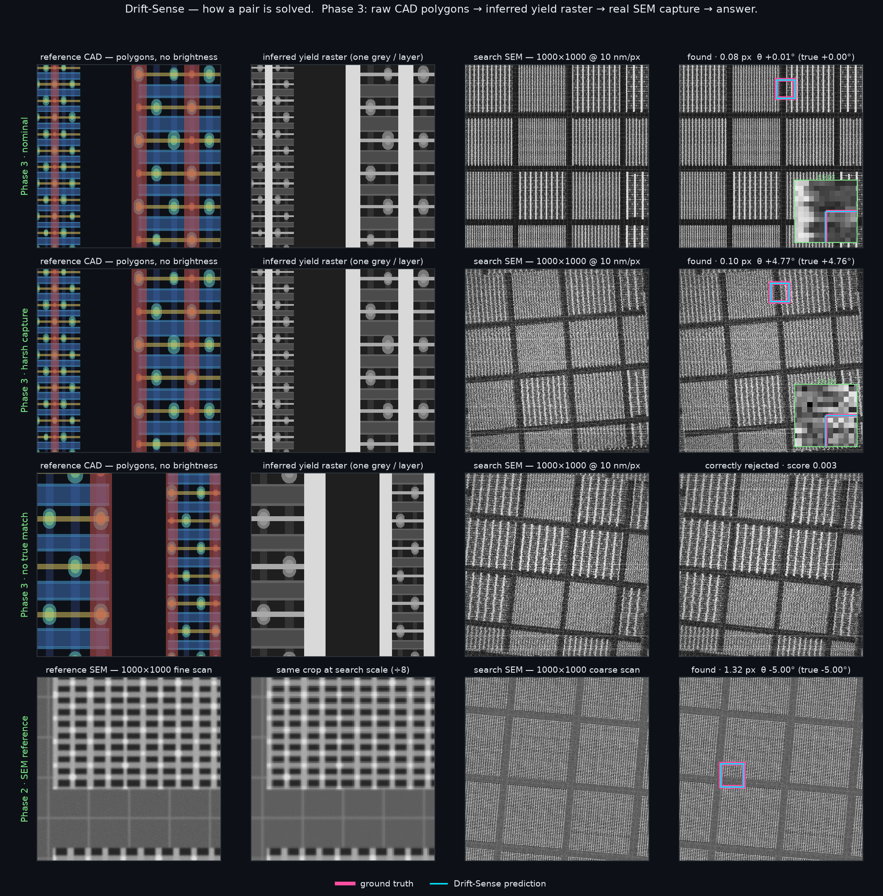
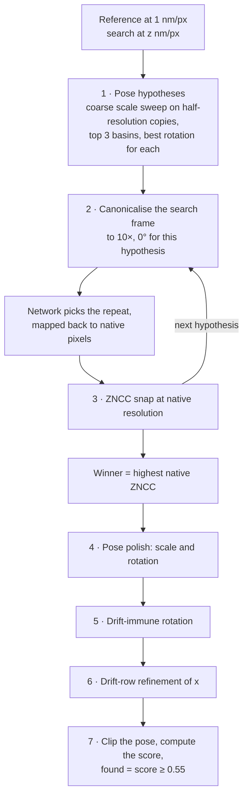
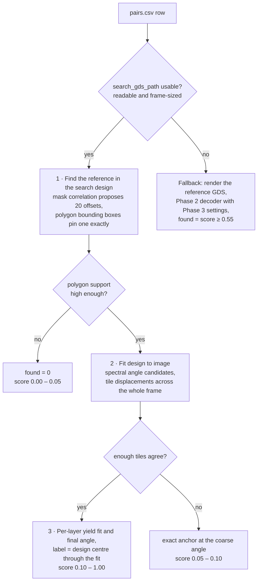
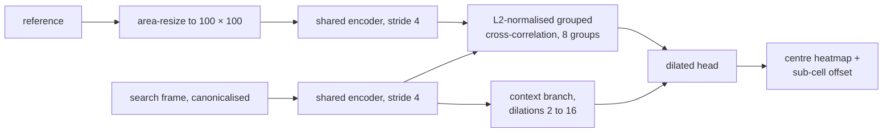
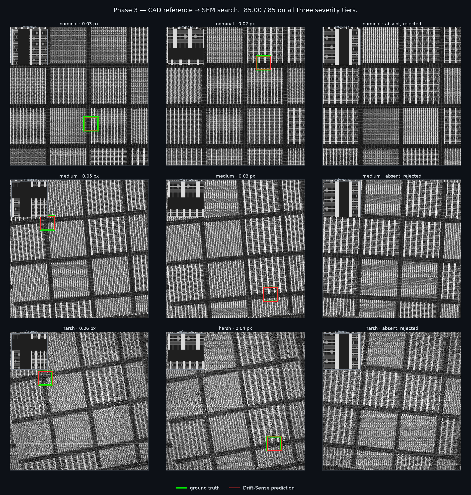
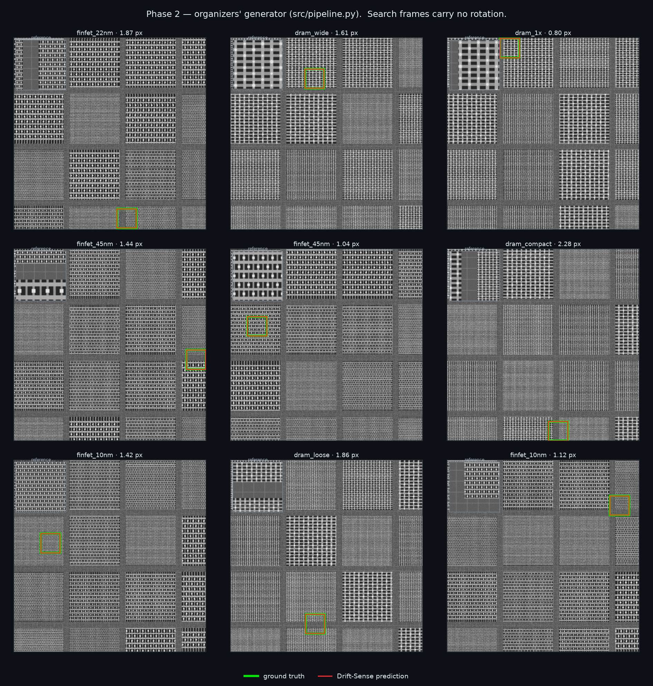

# Drift-Sense

**Navigation-error recovery for SEM metrology.** Find a known reference
pattern inside a wide SEM search frame of a repeating semiconductor layout,
report its pose — position, rotation and scale — and say plainly when it is not
there.

This repository is the **inference delivery** for two phases of the problem,
each in its own self-contained, CPU-only folder:

| | [Phase 2](phase_2/) | [Phase 3](phase_3/) |
| --- | --- | --- |
| Reference | SEM image, 1000 × 1000 px at 1 nm/px | GDSII design, 1000 × 1000 nm, up to 8 layers |
| Search | SEM image, 1000 × 1000 px at *z* nm/px, *z* ∈ [8, 12] unknown | SEM image, 1000 × 1000 px at 10 nm/px |
| Entry point | `phase_2/register.py` | `phase_3/phase3.py` |
| Method | a Siamese network picks the right repeat; classical pose search and correlation make the answer exact | an exact design-to-design match, then a whole-frame design-to-image fit — no neural network |
| Result | rejection 15 / 15 on the organizers' audited package; 1.44 px median error on their generator | **85.00 / 85** on every severity tier, 600 pairs |
| Median time | 0.89 s per pair | 0.58 s per pair |



*Four real pairs, one per row. Rows 1–3 are Phase 3: the reference CAD —
polygons with no brightness of their own — the yield raster inferred from it,
the SEM capture, and the answer; row 3 has no true match and is correctly
rejected. Row 4 is Phase 2: an SEM reference, the same crop at search scale,
the capture, and the answer. Ground truth is pink and the prediction cyan;
where the error is sub-pixel the two outlines are the same line, so those
panels carry a ±6 px inset of the box corner. Rows 2–4 are the bundled sample
pairs `p0001`, `p0000` and `A01`, so the [quick start](#quick-start) reproduces
them.*

## Architecture

One idea runs through both phases: **decide *which* repeat using the widest
evidence available, then decide *exactly where* with classical correlation at
full resolution.** In Phase 2 the wide evidence is a learned network's view of
the whole frame; in Phase 3 it is the design itself. Every numbered step is
explained in [How it works](#how-it-works).

### Phase 2: SEM reference → SEM search

Three pose hypotheses, the network to pick the repeat in each, and
native-resolution correlation to choose the winner and refine it.



### Phase 3: GDSII reference → SEM search

The design is matched against the design, exactly; the image only has to
supply the rotation. No neural network runs on the primary path.



### DriftSenseNet

The Siamese correlation network behind Phase 2 and Phase 3's image-only
fallback: 1,022,259 parameters, run on CPU.



---

## Contents

1. [Architecture](#architecture)
2. [The problem](#the-problem)
3. [Repository layout](#repository-layout)
4. [Quick start](#quick-start)
5. [Input format](#input-format)
6. [Output format](#output-format)
7. [Command-line reference](#command-line-reference)
8. [How it works](#how-it-works)
9. [Reliability guarantees](#reliability-guarantees)
10. [Results](#results)
11. [Runtime and resources](#runtime-and-resources)
12. [Logs and diagnostics](#logs-and-diagnostics)
13. [Troubleshooting](#troubleshooting)
14. [Known limitations](#known-limitations)
15. [Acknowledgements](#acknowledgements)

---

## The problem

When a scanning electron microscope drives to a measurement site, navigation
error can leave the site somewhere other than where it was expected. The tool
captures a wide, coarse **search** frame around the expected position and has
to find the known **reference** pattern inside it. This is the
*Navigation-Error Recovery* challenge set by Applied Materials.

What makes it hard is that the layouts are periodic. Memory arrays and FinFET
lattices repeat, so a patch the size of the reference correlates almost
equally well at dozens of positions, and local appearance alone cannot tell
them apart. On top of that, the search capture is noisy, drifts row by row
during the raster scan, may be scaled and rotated by an unknown amount, and in
some pairs does not contain the reference at all.

The challenge runs in phases, each removing an assumption:

| | Phase 1 | Phase 2 | Phase 3 |
| --- | --- | --- | --- |
| Reference | SEM image, 1 nm/px | SEM image, 1 nm/px | GDSII design, up to 8 layers, no brightness |
| Search pixel size | fixed, 10 nm/px | unknown per pair, *z* ∈ [8, 12] nm/px | 10 nm/px |
| Rotation | none | unknown within ±5°, must be reported | unknown, searched within ±10°, must be reported |
| Pairs with no true match | none | about 1 in 5 | about 1 in 12 |
| In this repository | legacy `infer.py` only | [`phase_2/`](phase_2/) | [`phase_3/`](phase_3/) |

### Constraints

The graded reference machine is a **4-core x86 CPU with 8 GB of RAM, no GPU,
no network access and Python 3.11**. The budget is a median of 5 s per pair,
with a hard timeout of 20 s per pair.

### Scoring

The published rubric awards localisation (40 points), scale (10), rotation
(10), present/absent rejection (15) and calibration (10), plus efficiency (5)
and a written analysis (10). The first five — 85 points — can be measured
locally, and that is the "/85" used throughout this README. Four properties of
the rubric shaped the design:

- **A missing row scores zero**, while a declined one does not — so every pair
  always gets a row. Declining beats disappearing.
- **The credit tiers are tight.** Full localisation credit needs the centre
  within 1 px (5 px earns 0.40), full scale credit needs under 1 % error, and
  rotation is judged to 0.25°. Finding the right repeat is not enough; the
  answer has to be sub-pixel.
- **Declining a present pair costs more than accepting an absent one**, because
  it forfeits localisation and pose as well as rejection F1. The found
  threshold is therefore set against the total rubric, not F1 alone.
- **Calibration is the AUC of the `score` column** against per-pair
  correctness, so the score has to rank pairs well, not just threshold them.

---

## Repository layout

```
.
├── README.md                    this file
├── how-it-works.png             the figure above
├── phase_2/                     SEM reference → SEM search
│   ├── register.py              ← entry point
│   ├── infer.py                 model loading, image I/O, classical fallback; also a legacy single-pair CLI
│   ├── driftsense/
│   │   ├── model.py             DriftSenseNet, the Siamese correlation network
│   │   ├── matching.py          pose search, network decode, ZNCC refinement, pose polish, drift correction, confidence
│   │   ├── config.py            the shipped operating point: every threshold and switch, defined once
│   │   ├── policy.py            the Phase 1 decode policy behind infer.py's CLI
│   │   ├── verification.py      alternative hypothesis selectors (off by default)
│   │   ├── calibration.py       logistic confidence models (not shipped)
│   │   └── subpixel.py          bicubic and upsampled-DFT sub-pixel refinement (not shipped)
│   ├── weights/driftsense.pt    the trained checkpoint, 16.5 MB, loaded automatically
│   ├── sample/                  3 real pairs + ground_truth.csv
│   ├── results.png              9 pairs from the organizers' generator
│   ├── requirements.txt         pinned, CPU-only
│   └── README.md                short folder-local guide
└── phase_3/                     GDSII reference → SEM search
    ├── phase3.py                ← entry point
    ├── register.py, infer.py    identical copies; phase3.py reuses their helpers
    ├── driftsense/              the seven Phase 2 modules, plus:
    │   ├── pairs3.py            strict Phase 3 pairs.csv reader
    │   ├── gds.py               GDSII reading and rasterisation (gdstk)
    │   └── cad_anchor.py        CAD-anchored registration, the primary path
    ├── weights/driftsense.pt    identical to Phase 2's
    ├── sample/                  2 real pairs (PNG + GDS) + ground_truth.csv
    ├── results.png              9 pairs, three per severity tier
    ├── requirements.txt         Phase 2's pins plus gdstk
    └── README.md                short folder-local guide
```

Each folder is **independent and portable**. It reads nothing outside itself,
resolves its weights relative to its own entry point rather than to your
working directory, and can be copied anywhere. The duplication is deliberate:
`register.py`, `infer.py`, the seven shared `driftsense/` modules and the
checkpoint are byte-identical in both folders.

This is the inference delivery only: no training code, dataset generator,
evaluation harness or test suite ships here.

---

## Quick start

**You need** Python **3.11** — the pins were frozen from a 3.11 environment,
matching the reference machine — and about 1 GB of free memory. No GPU, and
nothing reaches the network at run time. PyTorch 2.13 publishes Python 3.11
wheels for Linux (x86-64 and ARM64), Windows (x86-64) and Apple-silicon
macOS 14+.

### 1. Install and run

**Phase 2**, Linux or macOS:

```bash
cd phase_2
python3.11 -m venv venv
./venv/bin/pip install -r requirements.txt
./venv/bin/python register.py --input sample/pairs.csv --output sample/predictions.csv
```

**Phase 3**, Linux or macOS:

```bash
cd phase_3
python3.11 -m venv venv
./venv/bin/pip install -r requirements.txt
./venv/bin/python phase3.py --input sample/pairs.csv --output sample/predictions.csv
```

**Windows** (PowerShell) — the same steps with the `py` launcher and the
`Scripts` folder; for Phase 3, use `phase_3` and `phase3.py`:

```powershell
cd phase_2
py -3.11 -m venv venv
.\venv\Scripts\python -m pip install -r requirements.txt
.\venv\Scripts\python register.py --input sample\pairs.csv --output sample\predictions.csv
```

Phase 3's `requirements.txt` is Phase 2's plus `gdstk`, so one environment
built from `phase_3/requirements.txt` runs both.

> [!TIP]
> On Linux, PyPI's `torch==2.13.0` is the CUDA build and pulls in several
> gigabytes of NVIDIA libraries that this code never uses. For the CPU-only
> build, install torch from PyTorch's CPU index first; `pip` then treats the
> `torch==2.13.0` pin as already satisfied:
>
> ```bash
> ./venv/bin/pip install torch==2.13.0 --index-url https://download.pytorch.org/whl/cpu
> ./venv/bin/pip install -r requirements.txt
> ```

`--input` and `--output` are the only arguments you need; every other flag
defaults to a measured value. The weights resolve next to the entry point and
data paths resolve next to the CSV, so the command works from any directory:

```bash
phase_3/venv/bin/python phase_3/phase3.py --input phase_3/sample/pairs.csv --output out/predictions.csv
```

### 2. Check it worked

Both samples ship with a `ground_truth.csv`, and both include a site with **no
true match**, so you can confirm the rejection path as well as localisation.
The commands above produce exactly:

```
# phase_2/sample/predictions.csv
pair_id,x,y,theta,scale,found,score
A01,286.8979,532.3728,-5.0000,8.0337,1,0.933816
A02,207.5233,947.5849,4.8918,12.0000,1,0.713665
C01,0,0,0,0,0,0.000000

# phase_3/sample/predictions.csv
pair_id,x,y,theta,scale,found,score
p0001,548.0286,128.1153,4.7721,10.0000,1,0.457386
p0000,0,0,0,0,0,0.003061
```

| pair | ground truth | result |
| --- | --- | --- |
| Phase 2 `A01` | present · 8× · −5° | found · 1.32 px · rotation exact · scale +0.42 % |
| Phase 2 `A02` | present · 12× · +5° | found · 1.56 px · rotation 0.11° off · scale exact |
| Phase 2 `C01` | **no true match** | rejected |
| Phase 3 `p0001` | present · harsh capture · +4.76° | found · 0.10 px · rotation 0.015° off · scale exact |
| Phase 3 `p0000` | **no true match** | rejected, score 0.003 |

If `C01` or `p0000` comes back `found=1`, something is wrong.

The Phase 2 sample's ground truth is written in the pixel-edge convention —
note the constant −0.5 px error in *y*, which raster drift cannot cause.
Decoded with `--label-convention edge`, `A01` and `A02` land 0.27 px and
0.98 px from it. The shipped default is `center` because `driftsense/config.py`
records the grader's Phase 2 labels as pixel-centre; see
[Output format](#output-format).

Rarely, the last printed digit can differ on another CPU: the optimised
kernels re-associate floating-point sums, which moves coordinates by around
10⁻⁶ px.

---

## Input format

### Phase 2: flexible header

Three roles, matched case- and whitespace-insensitively. Several spellings are
accepted because Phase 1 and Phase 2 manifests spell these columns
differently. Extra columns are ignored, so a manifest carrying ground truth —
or the sample's `set_name` column — works unchanged.

| role | accepted spellings |
| --- | --- |
| identifier | `pair_id`, `id`, `pair` |
| reference image | `reference`, `reference_path`, `ref`, `ref_path`, `reference_image`, `template`, `template_path`, `high_res`, `highres` |
| search image | `search`, `search_path`, `sea`, `search_image`, `wide`, `wide_path`, `low_res`, `lowres` |

An exact spelling wins outright. Failing that, a substring match is tried —
but only if it selects exactly one column. Two or more candidates abort the
run rather than guess.

```csv
pair_id,reference_path,search_path
A01,reference/A01.png,search/A01.png
C01,reference/C01.png,search/C01.png
```

Images are read as 8-bit greyscale by OpenCV, so any format it can open works.
The expected geometry:

| | reference | search |
| --- | --- | --- |
| size | 1000 × 1000 px | 1000 × 1000 px |
| pixel size | 1 nm/px | *z* nm/px, *z* ∈ [8, 12], unknown per pair |
| field of view | 1 µm | 8–12 µm |

### Phase 3: strict header

Six columns, matched case- and whitespace-insensitively, in any order. There
are **no aliases**: every canonical name must appear in the header exactly
once, including the two withheld columns.

| column | at inference | content |
| --- | --- | --- |
| `pair_id` | required · non-empty · unique | copied verbatim to the output |
| `search_path` | required | the SEM capture: 1000 × 1000 px at 10 nm/px |
| `reference_gds_path` | required | the design to find: a `.gds` covering 1000 × 1000 nm, up to 8 layers |
| `search_gds_path` | value may be empty | the design of the **whole search frame**, in the image's own frame — the primary path, see below |
| `reference_sem_path` | header required, value withheld | filled in training data, empty on the blind split; never read at inference |
| `params_json_path` | header required, value withheld | as above |

```csv
pair_id,search_path,reference_gds_path,search_gds_path,reference_sem_path,params_json_path
p0001,search/00001.png,reference/00001.gds,search_gds/00001.gds,,
p0000,search/00000.png,reference/00000.gds,search_gds/00000.gds,,
```

The two trailing commas are the withheld columns, correctly empty.

**The withheld columns.** `pairs3.py` parses all six but exposes
`reference_sem_path` and `params_json_path` only through a training-only
accessor, which returns empty strings unless a row carries both. Nothing on the
inference path can come to depend on a value the scored run will not have.

**`search_gds_path` decides the score.** When it names a design covering the
whole search frame, the pipeline registers design against design and the
answer is exact; that is where 85.00 / 85 comes from. When the value is empty,
the file is unreadable, or it is reference-sized — a search design must span at
least half of the 10 µm frame on each axis, so pointing this column at the
reference file is caught — the pipeline falls back to matching a rendered
reference against the image. That path still answers, but it is far weaker:
**45.32 / 85** on the harsh tier. On the bundled sample, emptying this column
turns `p0001` from a 0.10 px hit into a decline.

**What is read from a `.gds`.** Only datatype-0 polygons — the drawn geometry;
annotation and fill datatypes are skipped — merged across all top-level cells,
with coordinates taken as nanometres. A layer's brightness comes from its
position in the stack, never from its name, so DRAM and FinFET files take the
same code path.

### Path resolution

Relative paths are resolved against the directory that contains `pairs.csv`,
so a dataset folder is portable:

```
sample/
├── pairs.csv            ← paths inside read "search/00001.png", …
├── search/00001.png
├── reference/00001.gds
└── search_gds/00001.gds
```

Absolute paths work too. Phase 3 additionally retries a relative path against
the current working directory when it does not exist relative to the CSV. Use
forward slashes: they work on every platform, backslashes only on Windows.

### Schema errors stop the run

If a required column is missing or ambiguous (in Phase 3, also duplicated), or
a Phase 3 `pair_id` is empty or repeated, the run stops **before anything is
written**, with a message naming the problem and exit code 1. This is deliberate. Inside the per-pair loop the same mistake
would turn every pair into a declined row, producing a well-formed, exit-0
`predictions.csv` that looks exactly like an honest all-reject run. An empty
output you can see beats a plausible output you cannot.

---

## Output format

Both phases write the same seven columns to `predictions.csv`, **one row per
input pair, in input order**:

| column | meaning | format |
| --- | --- | --- |
| `pair_id` | copied from the input | verbatim |
| `x`, `y` | match centre, in search-image pixels | 4 decimals |
| `theta` | rotation in degrees, counter-clockwise positive as displayed, about the match centre | 4 decimals |
| `scale` | recovered down-scaling factor *z*, i.e. the search image's nm/px — **not** 1/*z*; about 10 in Phase 3 | 4 decimals |
| `found` | `1` if the reference is judged present, else `0` | integer |
| `score` | confidence in [0, 1], used for calibration ranking | 6 decimals |

- **When `found=0`, every pose column is written as `0`.** A declined pair
  reports no position, so it cannot accidentally earn localisation credit.
- **Every pair always gets a row.** A pair that fails for any reason — an
  unreadable image, a malformed GDS, an exception — is written declined with
  `score` `0.0`, and a `[warn]` line naming the pair goes to stderr.
- **`score` is a genuine confidence, not a copy of `found`**, and it is written
  for declined pairs too.
- **Pixel convention.** Phase 2 writes pixel-centre coordinates by default —
  pixel *i* spans [*i* − 0.5, *i* + 0.5], the convention of the Phase 2 v2
  generator's labels — and `--label-convention edge` switches to pixel-edge,
  where pixel *i* spans [*i*, *i* + 1), as in the original Phase 2 generator.
  Phase 3 always writes pixel-edge coordinates, the CAD generator's
  convention.

### What `score` means

**Phase 2** reports `min(network confidence, ZNCC)` at the final pose, where
the ZNCC term is measured on a 3 × 3-median-filtered copy of the frame, and
`found = score ≥ 0.55`. The two terms fail differently — the network can be
confident about a plausible wrong repeat, and correlation can be respectable
on a degraded frame with no true instance — so requiring both is what
separates present from absent. The median filter touches only this number;
localisation sees raw pixels.

**Phase 3, CAD path.** The score is banded, so the ordering is structural:

| band | meaning |
| --- | --- |
| 0.00 – 0.05 | absent: `0.05 × support`, where support is the share of reference polygons found at a single exact offset |
| 0.05 – 0.10 | found at an exact design offset, but the design-to-image pose could not be verified |
| 0.10 – 1.00 | verified: `0.10 + 0.90 × support × tile agreement × (0.5 + 0.5 · R²)`, where R² is the per-layer brightness fit |

The bands are disjoint by construction, so a correct pair with a weak fit
never ranks below a pair whose pose was never established. On this path
`found` comes from the polygon support, not from a threshold. On the
**image-only fallback**, `score` is the Phase 2 statistic and
`found = score ≥ 0.55`.

---

## Command-line reference

### `phase_2/register.py`

```
python register.py --input pairs.csv --output predictions.csv [options]
```

| flag | default | effect |
| --- | --- | --- |
| `--input` | required | the `pairs.csv` to read |
| `--output` | required | the `predictions.csv` to write; missing parent directories are created |
| `--weights` | `weights/driftsense.pt` beside the script | the checkpoint |
| `--threshold` | `0.55` | `found = score ≥ threshold` on the learned path. The classical fallback ignores it and applies its own 0.55 gate to raw ZNCC — a different unit system |
| `--label-convention` | `center` | `center` or `edge`: the pixel convention of `x` and `y`. It also selects which scan row's drift sample the label carries |
| `--verification` | `zncc` | hypothesis selector: `zncc`, `consensus` or `majority`. The alternatives were measured and did not clear the promotion gate |
| `--threads` | `0`, meaning `min(4, cores)` | torch and OpenCV thread cap. The default deliberately overrides the libraries' own, which oversubscribe a 4-core machine |
| `--allow-fallback` | off | if the checkpoint cannot load, decode with the classical ZNCC matcher instead of aborting. **For debugging only**: it is materially weaker, and on the sample it accepts the absent pair |
| `--quiet` | off | suppress the progress display and the stdout summary; the machine-readable stderr lines remain |

### `phase_3/phase3.py`

```
python phase3.py --input pairs.csv --output predictions.csv [options]
```

| flag | default | effect |
| --- | --- | --- |
| `--input` | required | a Phase 3 `pairs.csv` |
| `--output` | required | the `predictions.csv` to write; missing parent directories are created |
| `--weights` | `weights/driftsense.pt` beside the script | the checkpoint. It must load even though the CAD path never uses it |
| `--threshold` | `0.55` | `found = score ≥ threshold`, **image-only fallback only** |
| `--verification` | `zncc` | hypothesis selector for the fallback |
| `--threads` | `0`, meaning `min(4, cores)` | as for Phase 2 |
| `--allow-fallback` | off | continue if the checkpoint cannot load: CAD-path pairs are unaffected, and fallback pairs use the classical ZNCC matcher |
| `--render-size` | `1000` | the reference raster size in px for the fallback, and the reference window size in nm for the CAD path |
| `--min-layer` | `0` | drop design layers below this index when rendering the reference (fallback only) |
| `--no-cad` | off | skip the CAD path and match the rendered reference against the image alone, for measurement and debugging |
| `--quiet` | off | accepted for symmetry with `register.py`; `phase3.py` has no progress display, so it changes nothing |

### `infer.py`: legacy single-pair CLI

Both folders carry `infer.py`, which the entry points import for model
loading, image reading and the classical fallback. Run directly, it is the
Phase 1 command-line tool:

```bash
python infer.py --reference ref.png --search search.png          # prints "x,y"
python infer.py ref.png search.png --json                          # JSON with score and diagnostics
python infer.py -r ref.png -s search.png --save-heatmap heat.png   # also writes the response map
```

It assumes Phase 1 geometry — search at about 10 nm/px, within ±10 % scale and
±2° rotation — reports no pose, and never declines. By default it runs one
network view and pays for 8-way dihedral voting only when that view's peak is
contested; `--no-tta` forces the single view, and `--save-heatmap` implies it.
If PyTorch or the weights are missing, it falls back to classical matching and
still prints a coordinate, with a warning on stderr. **It is not a graded
entry point:** on the Phase 2 samples, at 8× and 12× with ±5° rotation, it
returns positions hundreds of pixels off. Use `register.py` or `phase3.py`.

### Environment variables

| variable | default | effect |
| --- | --- | --- |
| `DRIFTSENSE_CHANNELS_LAST` | `1` | on CPU, fold BatchNorm into the convolutions and run the network in `channels_last` memory layout. `channels_last` alone measured 2.6× faster per pair, and folding cuts the search branch by a further ~28 %; outputs agree to about 5 × 10⁻⁶ px. `0` disables both |
| `DRIFTSENSE_FUSE_BN` | `1` | `0` keeps `channels_last` but skips the BatchNorm folding |
| `DRIFTSENSE_DEDUP` | `0` | `1` enables same-basin pose-candidate de-duplication — measured as a pure loss, kept for research only |
| `NO_COLOR` | unset | any value turns off ANSI colour in `register.py`'s display |

If a CUDA or Apple MPS device is visible, the model runs on it automatically
(`CUDA_VISIBLE_DEVICES=` hides a CUDA GPU). The graded configuration is
CPU-only.

### From Python

Both folders contain a package named `driftsense`, so use one phase folder per
Python process. Call `register.cap_threads()` first if you want the CLI's
thread cap.

**Phase 2.** Pass the shipped settings explicitly: the signature defaults of
`locate_phase2` reproduce an older decode, not the one `register.py` runs.

```python
import sys
sys.path.insert(0, "phase_2")

import infer
from driftsense import config
from driftsense.matching import locate_phase2

model, device = infer.load_model(infer.DEFAULT_WEIGHTS)   # returns None if it cannot load
ref = infer.read_gray("phase_2/sample/reference/A01.png")
sea = infer.read_gray("phase_2/sample/search/A01.png")

res = locate_phase2(model, ref, sea, device, refine=True,
                    verification=config.SHIPPED_VERIFICATION,
                    band=config.SHIPPED_BAND,
                    subpixel_rows=config.SHIPPED_SUBPIXEL_ROWS,
                    strip_rot=config.SHIPPED_STRIP_ROTATION,
                    label_convention=config.SHIPPED_LABEL_CONVENTION)
found = res["confidence"] >= config.SHIPPED_THRESHOLD
# res["x"], res["y"], res["theta"], res["scale"], res["confidence"]
```

**Phase 3.** `predict_pair` is exactly what `phase3.py` calls per row:

```python
import sys
sys.path.insert(0, "phase_3")

import infer
import phase3

model, device = infer.load_model(infer.DEFAULT_WEIGHTS)
res = phase3.predict_pair(model, device,
                          "phase_3/sample/reference/00001.gds",
                          "phase_3/sample/search/00001.png",
                          "phase_3/sample/search_gds/00001.gds")
# res["x"], res["y"], res["theta"], res["scale"], res["found"], res["score"],
# res["method"] ("cad" or "image"), plus diagnostics such as support,
# tiles_used and yield_r2 on the CAD path.
```

Both snippets reproduce the CLI's sample output exactly. Unlike the CLI, they
do not zero the pose of a declined pair.

---

## How it works

This section walks through the [architecture diagrams](#architecture) step by
step; the numbers below match the numbers in the diagrams.

### Phase 2 pipeline

1. **Pose hypotheses.** Correlation against a periodic layout is multi-peaked
   in scale: a wrong magnification can line the template up with the wrong
   repeat and still score well. So a coarse sweep — 17 scales across [8, 12]
   at 0°, on half-resolution copies — keeps the top **three** local maxima
   rather than the single best. Each takes the best of 11 rotations across
   ±5° and a cheap golden-section refine on a crop around its own peak.
2. **Canonicalise, then ask the network.** The network was trained on
   matched-scale, unrotated pairs, so instead of teaching it pose, each
   hypothesis resamples the *search frame* to the nominal 10×, 0° view. The
   network then makes the one hard decision — which of many identical-looking
   repeats is the right one — and its answer is mapped back to native
   coordinates. The template embedding is computed once and reused across
   hypotheses.
3. **Verify at native resolution.** A ±4 px ZNCC snap in the native frame,
   with a parabolic sub-pixel fit, places each hypothesis; a snap that jumps
   more than 10 px is refused as a neighbouring repeat. **The hypothesis with
   the highest native ZNCC wins**: a wrong scale basin can beat the right one
   on a half-resolution probe, but at full resolution it correlates near zero
   while the right one sits near 0.9. When the first hypothesis is
   uncontested — network ≥ 0.85, ZNCC ≥ 0.75 and peak ratio ≤ 0.25; or 0.72,
   0.72 and 0.35 with a coarse lead of at least 0.04 over the runner-up — the
   rest are skipped. The network is about 86 % of pair time, so that is close
   to a 3× saving on those pairs.
4. **Pose polish.** With the match located, scale (±3 %) and rotation (±0.8°)
   are re-fitted by golden-section search in a window around it, in the native
   frame, so the answer never inherits resampling blur. The template canvas is
   pinned so every candidate is scored over the same pixel count, and the
   template is continuous in scale; an integer-pixel resize would quantise
   [8, 12] into 43 plateaus, each as wide as the whole 1 % credit tier.
5. **Drift-immune rotation.** Raster drift shifts each scan row sideways, and a
   2-D fit cannot tell a linear shear from a small rotation. Vertical
   displacements are immune, because drift has no vertical component. The posed
   template is cut into 8 vertical strips, each strip's vertical offset is
   measured on a de-streaked, median-filtered copy of the frame, and the slope
   of offset against strip position gives the rotation residual. It is blended
   with step 4's estimate by inverse variance.
6. **Drift-row refinement of *x*.** The label is defined on the single scan row
   through the target centre, while a rigid match recovers the average drift
   over roughly 100 rows. Per-row horizontal offsets are measured, rows that
   locked onto the neighbouring lattice period are unwrapped, the patch is
   dewarped row by row and re-matched, and *x* is re-placed on the label's row
   — shrunk towards the rigid answer according to how well that row was
   measured. Where the row is unusable (about one pair in five), the stage
   declines and the rigid answer stands. *y* is left alone.
7. **Report.** Coordinates are expressed in the label convention (by default
   pixel-centre, 0.5 px up-left of the internal pixel-edge frame), scale and
   rotation are clipped into the disclosed [8, 12] and ±5° boxes, and the score
   is computed at the rigid match: `min(network, median-filtered ZNCC)`, with
   `found = score ≥ 0.55`.

An exception inside step 5 or 6 keeps the answer from the step before, so a
refinement can never cost a pair.

**Classical fallback.** Only with `--allow-fallback`, when the checkpoint
cannot load: whole-frame ZNCC over a grid of 9 scales (0.5 steps across
[8, 12]) and 11 rotations (1° steps across ±5°), gated at 0.55 on raw
correlation. It has no way to tell identical repeats apart, which is why it is
not a supported mode.

### Phase 3 pipeline

**Primary path: CAD-anchored, no neural network.** `cad_anchor.py` uses only
OpenCV and NumPy.

1. **Find the reference in the search design, exactly.** Both files come from
   the same undistorted design database, so the reference's polygons reappear
   in the search design at one integer-nanometre offset and nowhere else — no
   noise, no brightness to infer. Per-layer coverage masks at 10 nm/px,
   blurred by 1.5 px so that thin periodic features such as 13 nm fins do not
   alias, are correlated to propose 20 candidate offsets. Each candidate is
   pinned exactly by matching the bounding boxes of the reference's interior
   polygons, within a ±15 nm window and to 0.3 nm in size. The share of
   interior polygons reproduced at one offset — the **support** — is the
   present/absent decision: at least 0.5, or 0.8 when there are fewer than 20
   interior polygons. A reference with almost no polygon fully inside its
   window, such as a FinFET crop where every line runs off the edge, is
   matched on clipped boxes instead: each in-window box edge votes on one
   offset component, and the best combination must reproduce 80 % of the
   boxes.
2. **Fit design to image across the whole frame.** The search design is
   rendered with a default yield model. Up to three candidate angles come from
   the angular cross-correlation of the two log-polar magnitude spectra, which
   is translation-invariant. Each candidate is refined from the vertical
   displacements of 100 × 100 px tiles across the frame, fitted robustly as
   `dy = −dθ·x + ds·y + b` — vertical, because raster drift cannot reach that
   axis. The candidate with the most tiles agreeing, and agreeing most
   tightly, wins. That is 1000 × 1000 px of evidence instead of the
   reference's 100 × 100 px footprint, so the lattice ambiguity that dominates
   image-only matching never arises. On starved-dose, noisy frames, the
   tile-agreement floor steps down from 0.30 to 0.15 to 0.05.
3. **Infer the yield and report.** Per-layer grey levels are fitted by
   Huber-reweighted least squares — each pixel is a blend of the surfaces
   visible there, so the grey levels are regression coefficients — and one
   more rotation pass runs against the fitted rendering. The fit's R² feeds the
   score. The label is the design-window centre pushed through the generator's
   own design-to-pixel mapping at the fitted angle. Whole-frame translations
   under 5 px and magnifications under 3 % are deliberately not applied: at
   that size they are raster drift and distortion, which the label does not
   contain.

If the frame fit fails, the exact design anchor is still reported at the best
coarse angle, scored in the "unverified" band, rather than thrown away.

**Fallback: image only.** Used when `search_gds_path` is empty, unreadable or
reference-sized, when the CAD path cannot answer, or with `--no-cad`. The
reference GDS is rendered to a 1000 × 1000 raster in painter's order, higher
layers on top, with each layer's grey level set by its stack position:
secondary-electron yield from 0.20 for the bottom layer to 0.85 for the top,
and 0.12 for bare background. The raster is then decoded by the Phase 2
pipeline with Phase 3 settings: rotation searched across ±10° on a 21-point
grid, pixel-edge labels, and the drift-row stage off, because the CAD
generator labels the undrifted position. The expected raster shear is added
back to *x* instead, as 1.5 · *y* / (*h* − 1) px. `found = score ≥ 0.55`.

### The network

`DriftSenseNet` (`driftsense/model.py`) is a Siamese correlation network in
the SiamRPN++ style; its data flow is diagrammed under
[Architecture](#architecture).

| part | what it is | why |
| --- | --- | --- |
| shared encoder | a 7 × 7 stem and two residual blocks (dilation 1 and 2); total stride 4 | kept local, so the 25 × 25 template embedding is not mostly padding |
| cross-correlation | template and search embeddings L2-normalised and correlated in 8 channel groups | measures pattern agreement independently of dose and contrast, which differ between captures |
| context branch | four dilated convolutions (2, 4, 8, 16) over the search embedding | sees the composition of array mats and routing strips — the strongest globally unique cue, and invisible to plain correlation |
| head | four dilated convolutions (1, 2, 4, 8) over correlation and context | judges each peak against the surrounding lattice of decoy peaks, not in isolation |
| outputs | a centre heatmap and a 2-channel offset; cell (*i*, *j*) ↔ centre (4*j* + 50, 4*i* + 50) | a continuous prediction below the 4 px stride |

The shipped checkpoint is the wide variant — width 96, context 48, head 96 —
with **1,022,259 parameters** in 19 convolutions and no attention. The
architecture is read from the checkpoint's own `arch_kwargs`, so a checkpoint
of any width loads correctly, and loading uses `torch.load(weights_only=True)`,
which refuses arbitrary pickled objects. The network was trained on synthetic, noisy, matched-scale (10×), unrotated pairs;
pose is handled entirely by the search around it. On CPU, BatchNorm is folded
into the convolutions and the model runs in `channels_last` layout (see
[environment variables](#environment-variables)).

### Shipped configuration

Every threshold and switch lives in
[`driftsense/config.py`](phase_2/driftsense/config.py), defined once and read
by every entry point. Each value sits next to the measurement that justified
it: the dataset, the paired delta and its confidence interval.

| setting | value | meaning |
| --- | --- | --- |
| `SHIPPED_CONFIDENCE` | `"min_med3"` | Phase 2 score: `min(network, ZNCC on a 3 × 3-median frame)` |
| `SHIPPED_THRESHOLD` | `0.55` | Phase 2 found threshold |
| `LEGACY_FALLBACK_THRESHOLD` | `0.55` | the classical fallback's gate on raw ZNCC — a separate calibration in different units |
| `SHIPPED_LABEL_CONVENTION` | `"center"` | Phase 2 pixel convention |
| `SHIPPED_SUBPIXEL_ROWS` | `True` | drift-row refinement (step 6) |
| `SHIPPED_STRIP_ROTATION` | `True` | drift-immune rotation (step 5) |
| `SHIPPED_VERIFICATION` | `"zncc"` | the hypothesis with the best native ZNCC wins |
| `SHIPPED_BAND` | `False` | no band-pass filter on the coarse sweep |
| `SHIPPED_SUBPIXEL` | `"parabola"` | the sub-pixel rule for the ZNCC snap |
| `EARLY_EXIT_GATES` | two gates | the uncontested-hypothesis early exit (step 3) |
| `PHASE3_ROTATION_BOUNDS` | `(-10.0, 10.0)` | the Phase 3 rotation box |
| `PHASE3_COARSE_ROTATIONS` | `21` | a 1° coarse grid over that box |
| `PHASE3_LABEL_CONVENTION` | `"edge"` | Phase 3 pixel convention |
| `PHASE3_THRESHOLD` | `0.55` | Phase 3 fallback found threshold |
| `PHASE3_FALLBACK_SHEAR_PX` | `1.5` | expected raster shear added back to *x* in the fallback |
| `PHASE3_SUBPIXEL_ROWS` | `False` | drift-row stage off for Phase 3 |

The CAD path's own constants — support thresholds, tile size and floors, and
score bands — are at the top of
[`cad_anchor.py`](phase_3/driftsense/cad_anchor.py).

**Built, measured and switched off.** These remain in the code with their
measurements, so they can be re-tested rather than re-invented:

- a six-feature logistic confidence (`calibration.py`): higher AUC under
  cross-validation, but significantly worse on an untouched hold-out;
- bicubic and upsampled-DFT sub-pixel peaks (`subpixel.py`): failed the
  coordinate-stability gate;
- `consensus` and `majority` hypothesis selection (`verification.py`): the
  paired confidence interval spans zero;
- a band-pass coarse probe, rotation-aware re-ranking, candidate
  de-duplication, a rescue pass between close hypotheses, and coarse-grid
  pruning: each measured neutral or negative.

---

## Reliability guarantees

Each of these closes a failure mode that would otherwise produce a
plausible-looking wrong result:

1. **One row per pair, in input order, always.** Any per-pair failure becomes a
   declined row and a `[warn]` line; one bad pair never costs the rest of the
   run.
2. **Unreadable schemas abort before writing**, with exit code 1 and no
   `predictions.csv`.
3. **Model loading fails closed.** If the checkpoint or PyTorch cannot load,
   the run stops with `FATAL` and writes nothing, rather than silently swapping
   in the weaker classical matcher. `--allow-fallback` opts back in, and Phase 2
   then prints a `[FALLBACK]` banner at both ends of the run.
4. **No network, no downloads.** The weights ship in the folder and load with
   `weights_only=True`.
5. **A thread cap.** torch and OpenCV are capped at `min(4, cores)`: uncapped
   pools oversubscribe a 4-core machine, measured at 7.08 s per pair against
   1.58 s when tuned.
6. **Refinements cannot cost a pair.** An exception in a refinement stage keeps
   the previous answer.
7. **Blind-split safety (Phase 3).** The withheld columns are unreachable at
   inference, and empty or duplicate `pair_id`s are rejected up front.
8. **A mass-failure alarm (Phase 3).** From the eighth pair on, a
   `[MASS FAILURE]` banner goes to stderr as soon as 20 % of pairs have raised.
   At the end of the run, the banner and a `# mass_failure:` line appear if
   that error rate holds or if fewer than 30 % of pairs were reported found.
   The rows are still written; the banner says they are declines, not answers.

---

## Results

### Phase 3

600 pairs from the organizers' CAD pipeline, 200 per severity tier, scored on
the published rubric. Efficiency and the written analysis cannot be measured
locally, so the total is out of 85.

| tier | loc /40 | scale /10 | rot /10 | reject /15 | calib /10 | **/85** | median error | within 1 px |
| --- | --- | --- | --- | --- | --- | --- | --- | --- |
| nominal | 40.00 | 10.00 | 10.00 | 15.00 | 10.00 | **85.00** | 0.014 px | 183 / 183 |
| medium | 40.00 | 10.00 | 10.00 | 15.00 | 10.00 | **85.00** | 0.016 px | 183 / 183 |
| harsh | 40.00 | 10.00 | 10.00 | 15.00 | 10.00 | **85.00** | 0.029 px | 183 / 183 |

Every present pair lands within 1 px on all three tiers, every absent pair is
rejected, and no real pair is lost. Median rotation error is 0.002–0.005°.

The one assumption carrying that score is `search_gds_path`. On the same 200
harsh pairs:

| | /85 | loc /40 | median error | within 1 px | rejection F1 | s per pair |
| --- | --- | --- | --- | --- | --- | --- |
| with search GDS | **85.00** | 40.00 | 0.029 px | 183 / 183 | 1.000 | 0.31 |
| without: image-only fallback | **45.32** | 16.74 | 57.75 px | 30 / 183 | 0.692 | 2.11 |



*Nine pairs, three per tier; the right-hand column has no true match and is
rejected. Ground truth in green, prediction in red, and the rendered CAD
reference inset top-left. The boxes come from an actual `predictions.csv`;
where only green is visible, the two agree to within the line width.*

### Phase 2

Nine pairs from the **organizers' own generator** (seed 20260918), decoded by
`register.py` with shipped settings:

| | |
| --- | --- |
| found | **9 / 9**, no pair lost |
| median error | **1.44 px** (min 0.80, max 2.28) |
| rotation | reported θ ≈ 0° on every pair (\|θ\| ≤ 0.06°), matching a generator that applies none |
| scale | **10.00 ± 0.10** against a fixed 10× |
| runtime | median 1.37 s per pair, p90 1.93 s |

Two caveats, stated rather than buried. The error is measured against the
generator's raw `gt_x` and `gt_y`, which are computed on the geometry *before*
imaging applies raster drift (1.5 px of shear by default), so part of the
1.44 px lies between the label and where the pattern actually is. And this
generator emits no absent pairs and no rotation, so it does not exercise
rejection or rotation. The organizers' 20-pair audited package does, and
rejection scores **15 / 15** there.



*The nine pairs above. Ground truth in green, prediction in red, and the
reference inset top-left.*

On internal synthetic validation splits — not organizer-issued data — the most
recent recorded total for the full Phase 2 decode, taken when the
drift-immune rotation stage was promoted, is **83.18 / 85** on a 500-pair
hold-out and 83.15 / 85 on a 250-pair split weighted towards the harshest
severities. The measurement behind every Phase 2 stage is recorded next to its
constant in `config.py` and `matching.py`.

---

## Runtime and resources

| | median | p90 | max | measured on |
| --- | --- | --- | --- | --- |
| Phase 2 | 0.89 s | 1.11 s | 1.19 s | the organizers' 20-pair audited package, 4 threads |
| Phase 3 | 0.58 s | 0.70 s | 0.84 s | 600 pairs across three tiers, 4 threads |

The budget is a 5 s median and 20 s per pair, and peak memory stays under about
1 GB.

- Times scale with single-core speed and machine load, so measure on an idle
  machine.
- In Phase 2, pairs with no true match are the slowest: no hypothesis clears
  the early-exit gates, so all three are decoded.
- Phase 3 is the faster of the two because its primary path is geometry, not
  a network. Its image-only fallback is about 7× slower, at 2.11 s per pair on
  the harsh tier.
- `register.py` prints a warning if any pair exceeds 20 s.

---

## Logs and diagnostics

`predictions.csv` is the only file a run writes, apart from the optional
timing sidecar described below. Everything else goes to the console, and
lines that start with `#` are meant for machines.

| | Phase 2 (`register.py`) | Phase 3 (`phase3.py`) |
| --- | --- | --- |
| stdout | a header card; live progress (animated on a terminal, otherwise a line every 25 pairs); `wrote N rows to <path>`; `runtime: median … p90 … max … total …`; a summary card | `wrote N rows to <path>` |
| stderr | `# per-pair seconds`, then `# t,<pair_id>,<seconds>` per pair; `# runtime: median … p90 … max … n=N`; `[warn] pair …`; `[FALLBACK]` banners | `# t,<pair_id>,<seconds>` per pair; `# runtime: …`; `[warn] pair …`; `[MASS FAILURE]` banners and `# mass_failure: errors=E found=F n=N` |

When stderr is an interactive terminal, `register.py` writes the per-pair
`# t,…` lines to `<output>.timing` instead, so that they do not scroll the
progress display away; the summary card names the file. `--quiet` silences
stdout without touching stderr, and `NO_COLOR` turns off colour.

---

## Troubleshooting

| symptom | cause and fix |
| --- | --- |
| `could not find the … column` or `the … column is ambiguous` (Phase 2) | no recognised spelling for a role, or several columns match it. Rename the columns to canonical spellings |
| `… is not a readable Phase 3 pairs.csv` | a column is missing (all six names must be in the header, even the withheld ones) or duplicated, or a `pair_id` is empty or repeated. The message names which |
| `FATAL: learned model failed to load` | `weights/driftsense.pt` is missing or truncated — it must be exactly 16,504,444 bytes — or PyTorch will not import. Check that you are running the venv's Python |
| every pair `found=0`, with `[warn] … could not read image` | the paths do not resolve. They are relative to `pairs.csv`, not to your shell; open one by hand |
| `Phase 3 needs the 'gdstk' package` | the environment was built from `phase_2/requirements.txt`; install `phase_3/requirements.txt` |
| `[MASS FAILURE]` on stderr (Phase 3) | many pairs raised or few were found — usually wrong paths, or an empty `search_gds_path` sending every pair to the fallback. On a batch of one or two genuinely absent pairs it is expected: the found-rate check has no minimum batch size |
| Phase 3 far below the results above | `search_gds_path` is empty or points at a reference-sized file, so every pair takes the image-only fallback |
| Phase 2 positions consistently off by about half a pixel in *x* and *y* | the labels use the other pixel convention; try `--label-convention edge` |
| slow | check the thread count on the header card, keep `--threads` at or below the number of physical cores, and run on an idle machine |

---

## Known limitations

- **Phase 3 accuracy rests on `search_gds_path`.** Without a frame-sized search
  design, the image-only fallback scores 45.32 / 85 on the harsh tier and
  misses the present sample pair.
- **The Phase 2 label convention is a property of the dataset.** The default
  suits pixel-centre labels; pixel-edge data, including the bundled sample,
  needs `--label-convention edge`. The wrong choice costs points either way.
- **Phase 2 error against raw generator labels is about 1.4 px**, largely
  because those labels are computed before raster drift is applied.
- **Phase 2 does not check for duplicate `pair_id`s**; it writes one row per
  input row. Phase 3 rejects them.
- **Phase 3 needs the checkpoint to load** even when every pair takes the CAD
  path, and fails closed if it cannot.
- **`--allow-fallback` is a debugging aid, not a degraded mode.** The classical
  matcher cannot tell identical repeats apart, and it accepts the absent
  Phase 2 sample pair.
- **`infer.py` handles Phase 1 geometry only.**

---

## Acknowledgements

- The problem is the *Navigation-Error Recovery* challenge set by Applied
  Materials.
- The network was trained on synthetic data from a generator based on
  [`aayushraina21/drift-sense-synthetic-data`](https://huggingface.co/spaces/aayushraina21/drift-sense-synthetic-data).
  The generator is not part of this delivery.
- Methods referenced in the code:
  - B. Li *et al.*, "SiamRPN++: Evolution of Siamese Visual Tracking with Very
    Deep Networks", CVPR 2019 — the cross-correlation architecture.
  - D. S. Bolme *et al.*, "Visual Object Tracking using Adaptive Correlation
    Filters", CVPR 2010 — the peak-to-sidelobe ratio used in the response-map
    diagnostics.
  - M. Debella-Gilo and A. Kääb, *Remote Sensing of Environment*, 2011, and
    M. Guizar-Sicairos, S. T. Thurman and J. R. Fienup, *Optics Letters* 33,
    2008 — the sub-pixel variants in `subpixel.py`.
  - C. Guo *et al.*, "On Calibration of Modern Neural Networks",
    arXiv:1706.04599 — the calibration analysis in `calibration.py`.
